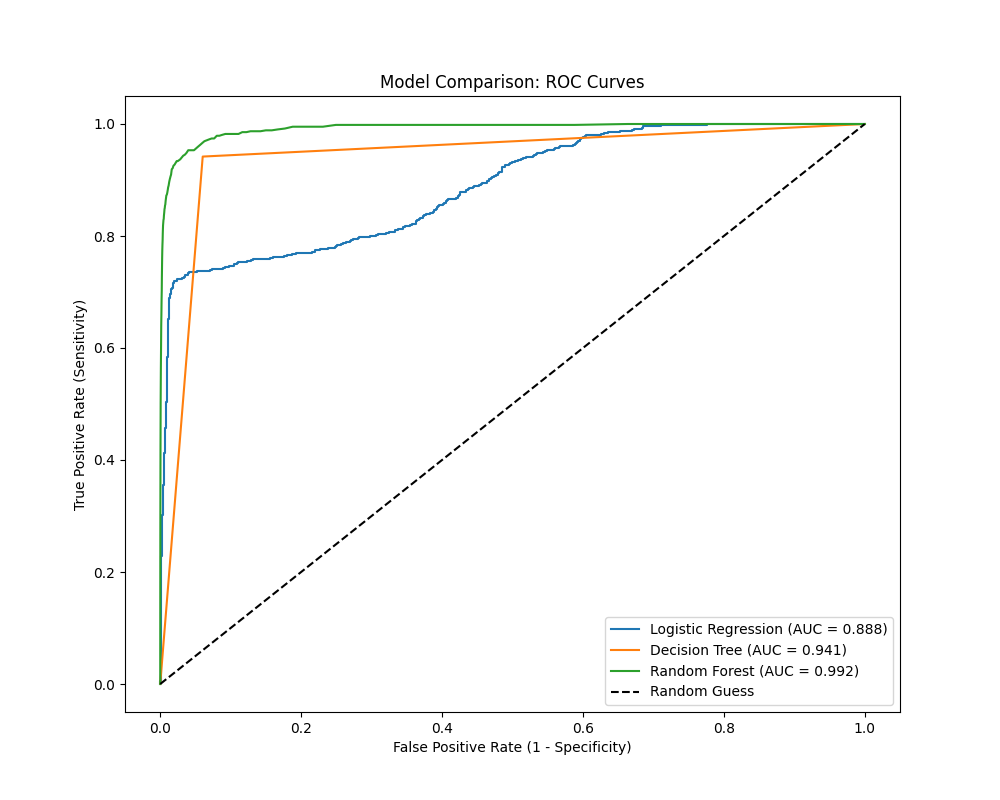

# credit-card-fraud-detection
Replication of Elsevier 2023 paper: Comparative analysis of Random Forest vs. Logistic Regression for fraud detection.

# Credit Card Fraud Detection: Random Forest vs. Baselines

## 📌 Project Overview
This repository contains a production-level replication of the research paper:
> **"A supervised machine learning algorithm for detecting and predicting fraud in credit card transactions"** (Elsevier Decision Analytics Journal, 2023).

The project compares **Logistic Regression**, **Decision Trees**, and **Random Forests** on a dataset of 555,719 transactions. It handles extreme class imbalance (0.4% fraud rate) using **Random Under-Sampling** to achieve a specific focus on minimizing False Negatives.

## 🚀 Key Results
The replication successfully reproduced the findings of the original paper, with **Random Forest** achieving superior performance.

| Model | Accuracy | AUC Score | Sensitivity (Recall) |
| :--- | :--- | :--- | :--- |
| **Random Forest** | **96%** | **0.992** | **High** |
| Decision Tree | 94% | 0.941 | Moderate |
| Logistic Regression | 92% | 0.888 | Low |



## 🛠️ Technical Approach
* **Preprocessing:** Range transformation (0-1 scaling) and manual feature selection based on collinearity analysis (removing redundant spatial features).
* **Imbalance Handling:** Implemented `RandomUnderSampler` to balance the training distribution without biasing the test set.
* **Validation:** Used a strict temporal split (Train/Test) to prevent data leakage, simulating a real-world banking environment.

## 💻 How to Run
```bash
# 1. Install dependencies
pip install pandas scikit-learn imbalanced-learn matplotlib

# 2. Run the analysis script
python fraud_replication.py
```
